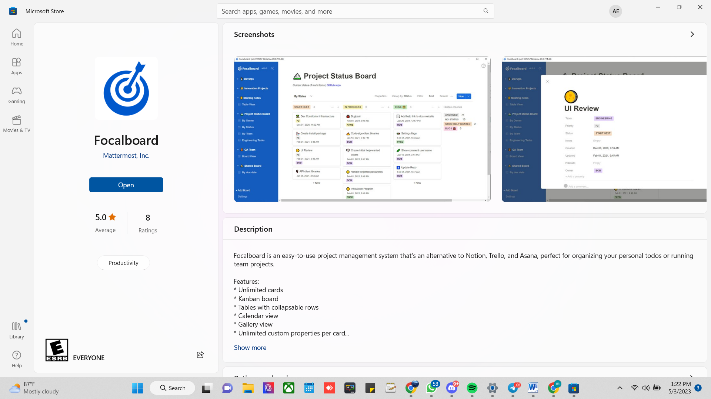
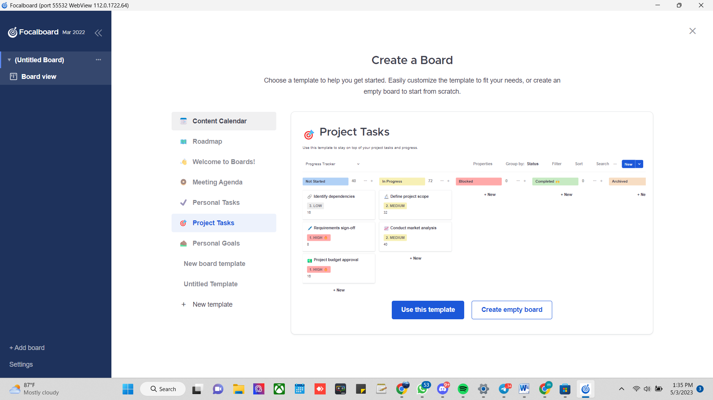
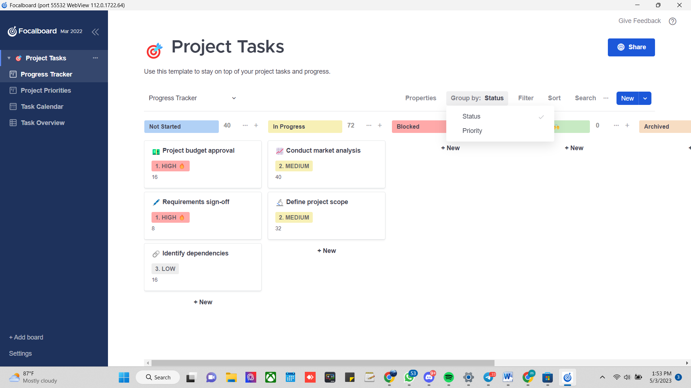
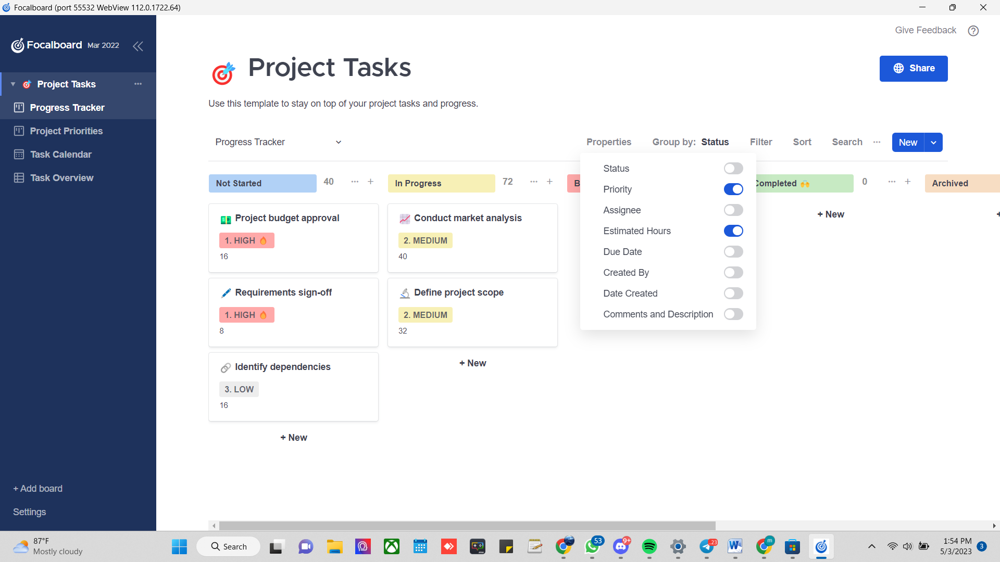
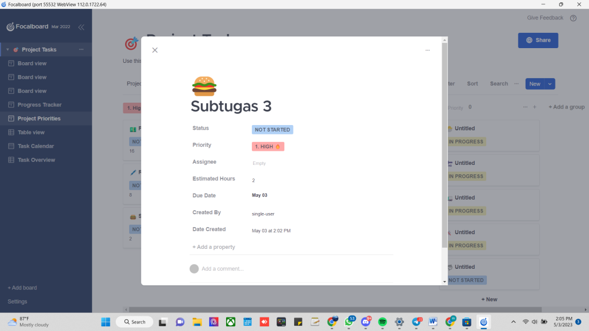
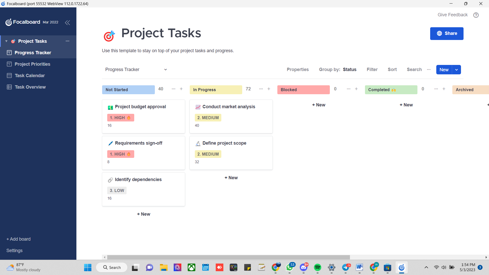
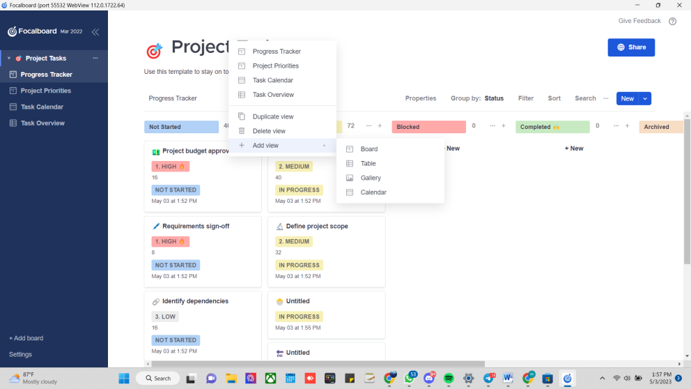
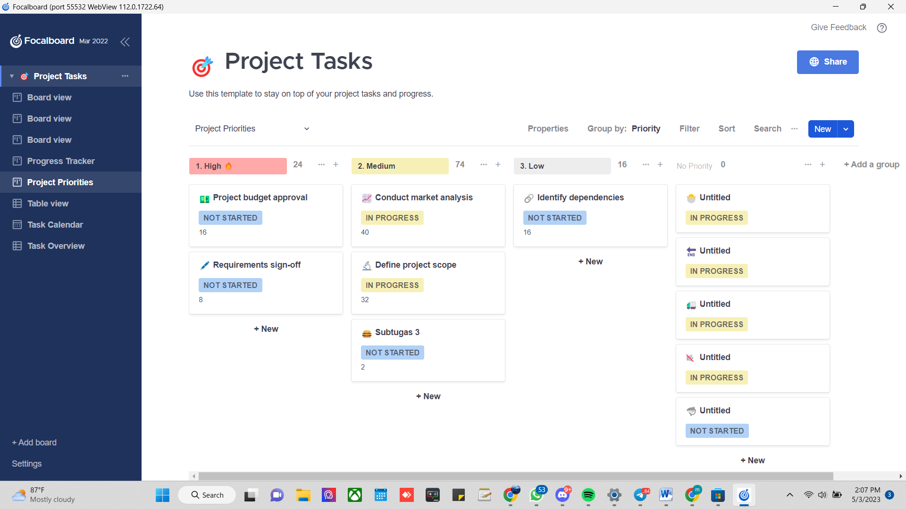

# Tool-Manajemen-Proyek-Focalboard
by Anneke Shavira M [19081010041]

# Melakukan Manajemen Projek dengan Focalboard

## I. Tentang Focalboard

Focalboard merupakan aplikasi manajemen proyek bersifat opensource yang dapat menjadi alternative tools seperti asana, trello dan juga notion. Tool ini membatu proses manajemen proyek yang dilakukan baik secara probadi maupun berkelompok atau dengan tim. Focalboard  hadir dengan tiga edisi, yaitu Mattermost Board, Personal Dekstop dan personal server

**1.	Mattermost Boards**

Mattermost Boards mengkombinasikan tool manajemen proyek dengan message dan kolaborasi untuk tim dengan segala ukuran. Untuk dapat mengaksesnya, kita dapat menginstall Mattermost v6.0 atau yang terbaru sebagai self-hosted server. Setelah login di dalamnya, pilih menu di sebelah kiri lalu pilih Boards.

**2.	Personal Dekstop**

Windows : Download dari Windows App Store atau  download di https://github.com/mattermost/focalboard/releases
Mac : Download from the Mac App Store
Linux Dekstop  : Download dari https://github.com/mattermost/focalboard/releases

**3.	Personal Server**

Download dan run compiled focalboard personal server atau Ubuntu melalui https://www.focalboard.com/download/personal-edip tion/ubuntu/

##II.	Cara penggunaan focalboard

**1.	Instalasi Focalboard di windows**

Kita dapat melakukan instalasi tool focalboard dengan mengintall aplikasi di Microsoft store dengan mengeklik install

Gambar 2.1 - Install Focalboard di Windows

**2.	Membuat projek pertamamu**

Setelah melakukan proses instalasi, berikut merupakan tampilan awal aplikasi focalboard saat kita mengaksesnya. Kita dapat membuat projek pertama kita dengan memilih opsi Project task yang terletak d I bawah header “Create a Board” lalu kita akan memilih “use this template” atau “create empty board” untuk membuat board kosong

Gambar 2.2 – Membuat Projek pertama di asana

Berikut di bawah ini merupakan tampilan yang akan kita lihat apabila kita memilih project task. Kita dapat meng-cuztomisasi card project sesuai dengan kebutuhan kita.

 

Gambar 2.3 – Tampilan card progress projek di asana

**3.	Menampilkan projek berdasarkan status**

Setelah kita menuliskan projek sesuai dengan kebutuhan, kita dapat melakukan view ataupun mengatur visibilitas card projek sesuai dengan kategori yang kita inginkan.

Gambar 2.4 – Menampilkan projek berdasarkan status

**4.	Mengedit title board dan menambahlkan subtugas**

Berikut di bawah ini merupakan tampilan card project yang telah kita edit sesuai kebutuhan kita.

Gambar 2.5 – Mengedit title board dan menambahkan subtugas

Kita dapat mengubah tiap card dengan memilih card tersebut dan kita dapat langsung mengubah judul, memberikan beberapa keterangan seperti prioritas, status maupun durasi pekerjaan.                             
    
 

Gambar 2.5 – Tampilan card projek setelah diedit
   
**5.	Memindahkan status project sesuai dengan kategori berjalannya projek**
Kita dapat melakukan drag and drop card project sesuai dengan progress yang berjalan

Gambar 2.6 – Memindahkan status projek

**6.	Mengubah tampilan penyajian progress projek**
Kita dapat mengubah tampilan penyajian dalam bentuk board, table, galleria maupun calendar dengan memilih opsi kategori sesuai yang kita inginkan.

Gambar 2.7 – Mengubah tampilan penyajian projek

**7.	Membagikan task**

Untuk melakukan kolaborasi ataupun membagikan progress suatu projek yang telah kita buat kira dapat memilih opsi share yang terletak pada pojok kanan atas.

Gambar 2.8 – Membagi task

Dengan memilih opsi share, akan muncul sebuah link sharing yang dapat kita bagikan kepada orang lain dan orang lain dapat melihat progress projek yang kita bagikan.

Gambar 2.9 – Link untuk membagikan progress projek

